# DOM Manipulation Assignment

---

1. Webiste Name: [Dev To](https://dev.to/)

### Topics :

    - Query Selctory, Inner HTML

### Sample Image :


### Tasks :

        Target the Top description div and change the DEV Community to <Your_Name> and description to your passion

### Expect Output :


### Solution :
```
document.querySelector(".side-bar .crayons-card .crayons-subtitle-2").innerHTML = "Vandit Bera";

document.querySelector(".side-bar .crayons-card .color-base-70").innerHTML = "Hello! Everyone, My name is Vandit Bera. I'm passionate about creating and developing clean, and unique products. I specialize in building Websites for small to medium size businesses. I keep my code clean, readable, modular, and well-refactored. I enjoy working with complex user interfaces. YOU DREAM IT. I CREATE IT. ❤️ I WRITE CODE ❤️ ";
```

### My Output :
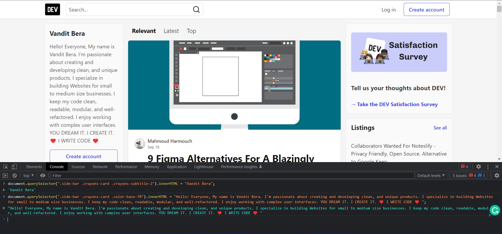


---


2. Website Name: [Apple](https://support.apple.com/en-in)

### Task :


### Fetch all the product name and store in an array

### Expect Output :

['iPhone', 'Mac', 'iPad', 'Watch', 'AirPods', 'Music', 'TV']


### Solution :
```
let arr = []; document.querySelectorAll(".as-imagegrid-item").forEach((e) => arr.push(e.innerText.replace("\nSupport", ""))); 

console.log(arr);
```

### My Output :
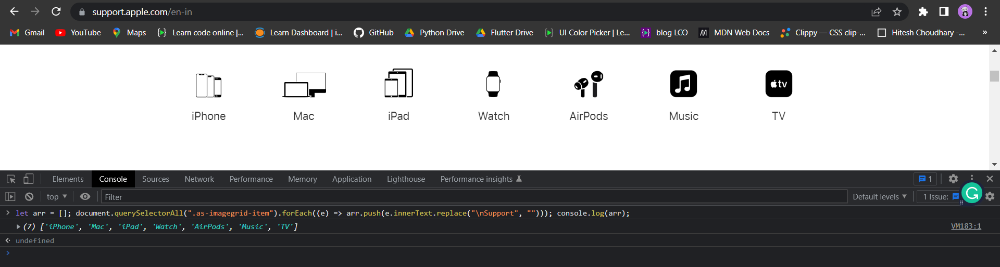

---

3. Webiste Name: [Youtube Support](https://support.google.com/youtube/)

### Topics :

    - Get Element By Id, Create Element, Create Text Node, Append Child

### Sample Image :


### Tasks :

     Add another FAQ 'My New FAQ' to the list

### Expect Output :


### Solution :
```
let nav = document.querySelector(".article .accordion-homepage"); 

let section = document.createElement("section"); section.className = "parent"; 

section.appendChild(document.createElement("h3")); 

section.querySelector("h3").textContent = "My New FAQ"; 

nav.appendChild(section);
```

### My Output :
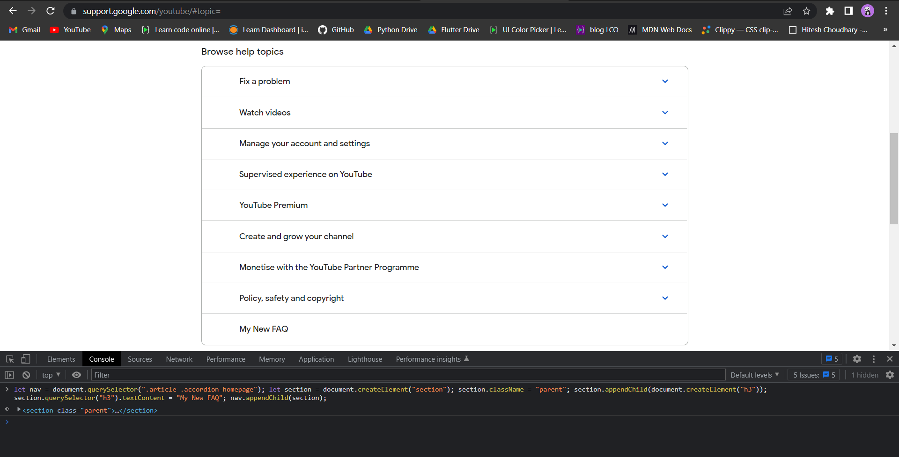


---


4. Webiste Name: [OnePlus](https://www.oneplus.in/support)

### Topics :

     Query Selector, InnerText

### Sample Image :


### Tasks :

      Change the contact number

### Expect Output :


### Solution :
```
document.querySelector(".one-tel-number").innerText = "+91 6366256689";
```

### My Output :
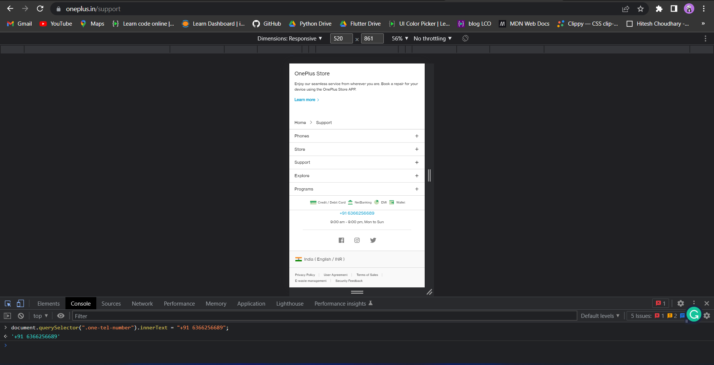


---


5. Webiste Name: [Samsung](https://www.samsung.com/in/offer/online/samsung-fest/)

### Topics :

       getElementById, createElement, InnerText, append, setAttribute

### Sample Image :


### Tasks :

     Target the main div of card and change the Button text to Check out

### Expect Output :


### Solution :
```
document.querySelector(".feature-column-carousel__button .cta").innerText = "Check out";
```

### My Output :
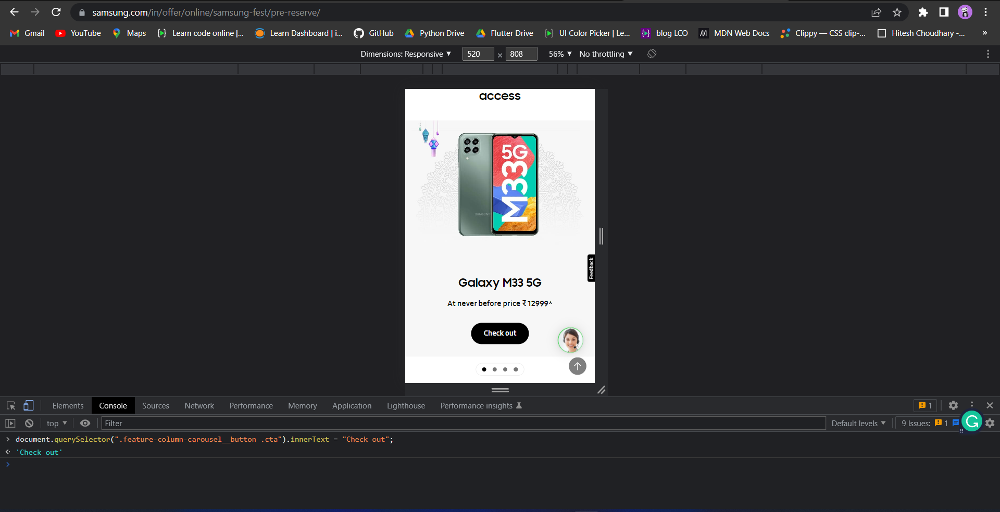


---


6. Webiste Name: [Adidas](https://www.adidas.co.in/)

### Topics

    -   Query Selector, Event listeners, Changing Styles

### Sample Image :


### Tasks :

     Target the search box and on hover change thebackground color to red.

### Expect Output :


### Solution :
```
document.querySelector(".searchinput___zXLAR").addEventListener("mouseover", function hello() {document.querySelector(".searchinput___zXLAR").style.backgroundColor = "red";});
```

### My Output :
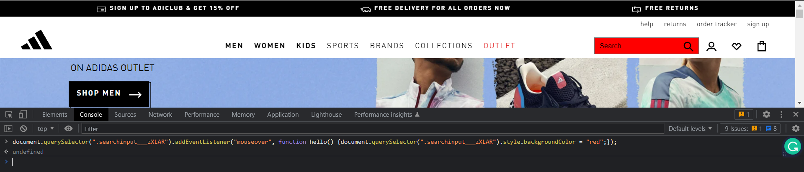


---


7. Webiste Name: [MDN Web Docs](https://developer.mozilla.org/en-US/)

### Topics :

       Form, Value, Submit

### Sample Image :


### Tasks :

     To Search a topic in the MDN Search bar.
     First add a text to search in the search bar and then hit the submit search button to search the docs using DOM

### Expect Output :


### Solution :
```
function search(Text) {
  let input = document.querySelector("#hp-search-input");
  input.value = Text;
  let form = document.querySelector("#hp-search-form");
  form.submit();
}
search("css");
```

### My Output :
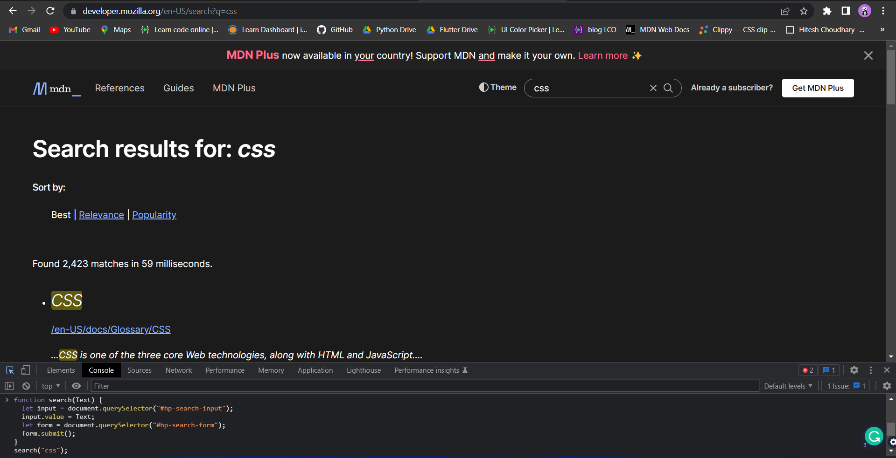


---


8. Webiste Name: [Google](https://www.google.com/)

### Topics :

       Remove Elements

### Sample Image :


### Tasks :

     Remove alternate languages from the home page languages listed

### Expect Output :


### Solution :
```
let arr = document.querySelectorAll("#SIvCob a");
for (i = 0; i < arr.length; i++) {
  if (i % 2 == 0) {
    arr[i].remove();
  }
}
console.log(arr);
```

### My Output :
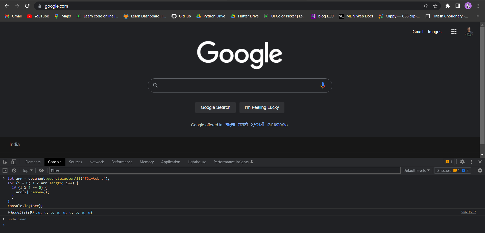


---


9. Webiste Name: [Code Wars](https://www.codewars.com/)

### Topics :

       Change Font Family, Color of Text.

### Sample Image :


### Tasks :

    Change the font family of the text to monospace and text color to the logo’s background color.

### Expect Output :


### Solution :
```
document.querySelector(".content-width-extra-large .display-heading-1").style.fontFamily="monospace";

document.querySelector(".content-width-extra-large .display-heading-1").style.color="red";
```

### My Output :
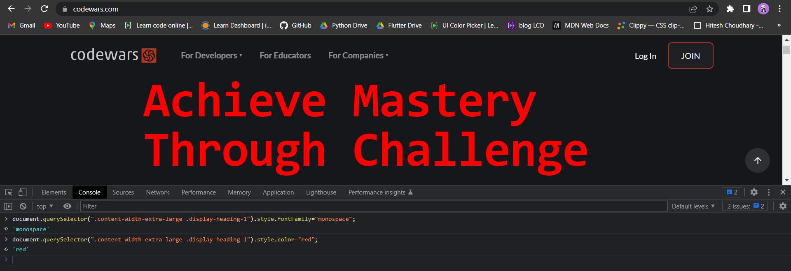


---


10. Webiste Name: [Freecodecamp](https://www.freecodecamp.org/)

### Topics :

       querySelector, mouseover, click eventListener,  callback function, style,

### Sample Image :


### Tasks :

    Target the button and change background colour on mouseover

### Expect Output :


### Solution :
```
document.querySelector(".col-lg-8 .login-btn-text").addEventListener("mouseover", function hello() {document.querySelector(".col-lg-8 .login-btn-text").style.backgroundColor = "red";});
```

### My Output :
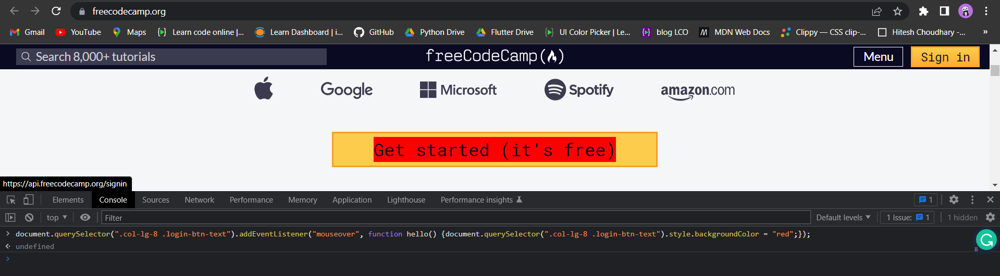


---


11. Webiste Name: [realme](https://www.realme.com/in/)

### Topics :

       querySelector,style,background-image

### Sample Image :

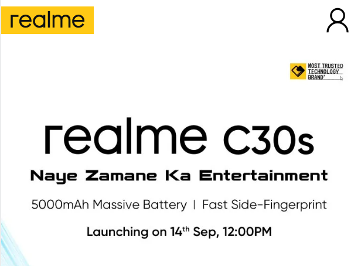

### Tasks :

    change the realme logo to ineuron logo

### Expect Output :


### Solution :
```
document.querySelector(".logo .icon").style.backgroundImage = "url('https://ineuron.ai/images/ineuron-logo.png')";
```

### My Output :
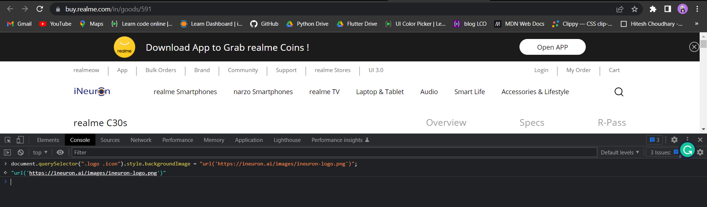


---


12. Webiste Name: [Github](https://github.com/)

### Topics :

       querySelector,style,background-Color

### Sample Image :


### Tasks :

     change the background colour of the button to blue.

### Expect Output :


### Solution :
```
document.querySelector(".dashboard-sidebar .Details.js-repos-container .f4 .btn").style.backgroundColor = "blue";
```

### My Output :
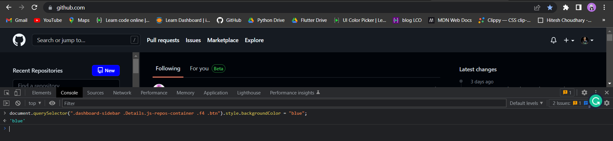


---


13. Webiste Name: [Hackerrank](https://www.hackerrank.com/)

### Topics :

       querySelector,innerHtml

### Sample Image :


### Tasks :

Target the top description and change “Matching developers with great companies” to ‘JSBOOTCAMP“.

### Expect Output :


### Solution :
```
document.querySelector(".entry-content .fl-heading .fl-heading-text").innerHTML = "JSBOOTCAMP";
```

### My Output :
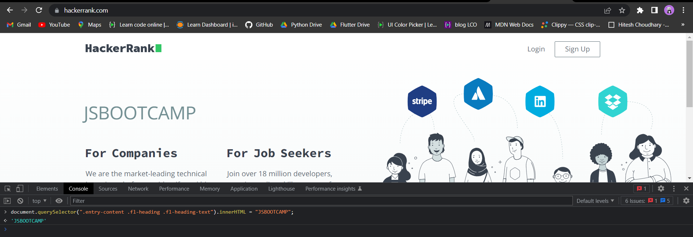


---


14. Webiste Name: [Asus](https://www.asus.com/in/)

### Topics :

      querySelector,style,font-size

### Sample Image :


### Tasks :

       change the fontsize of “Hot Deals” to 80px

### Expect Output :


### Solution :
```
document.querySelector("#skipContentFocus .HotDealsAll__HotCampaignsEventsContainer__FK0V2 .HotDealsAll__Heading__2fIbe").style.fontSize = "80px";
```

### My Output :
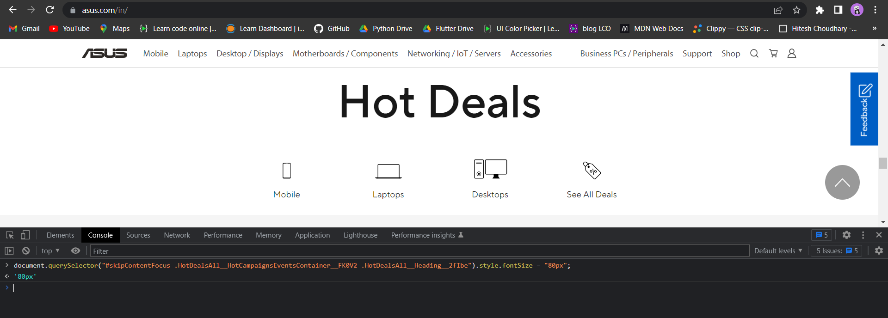


---


15. Webiste Name: [Dell](https://www.dell.com/en-in/shop/deals/laptop-deals?gacd=10415953-9016-5761040-285981356-0&dgc=ST&gclid=Cj0KCQjwguGYBhDRARIsAHgRm4-XUDMhhVNyHXb3s1gY4ZBzORr_d9Se-buhJwy7asyUe7YdqEA11eEaAt6UEALw_wcB&gclsrc=aw.ds&nclid=BxjBlpBQsX6pjSHh-L8YYSU77EpfXRkG1AGMB5Wbeu386ykspfrPDnfx_DdFau20)

### Topics :

      querySelector,style.textAlign

### Sample Image :


### Tasks :

       Convert the text “G15 Gaming Laptop” from left to right

### Expect Output :


### Solution :
```
document.querySelector("#main-content-container .row .col-md-6 .mb-2 .mb-md-0 .page-title").style.textAlign = "right";
```

### My Output :
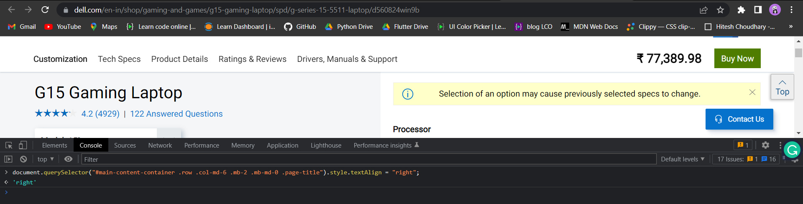


---


16. Webiste Name: [Vercel](https://vercel.com/)

### Topics :

     querySelector,innerHTMl

### Sample Image :


### Tasks :

      change the heading “Start with the developer” to “Start with Scratch”

### Expect Output :


### Solution :
```
document.querySelector(".section-title_title__VEDfK").innerText = "Start with Scratch";
```

### My Output :
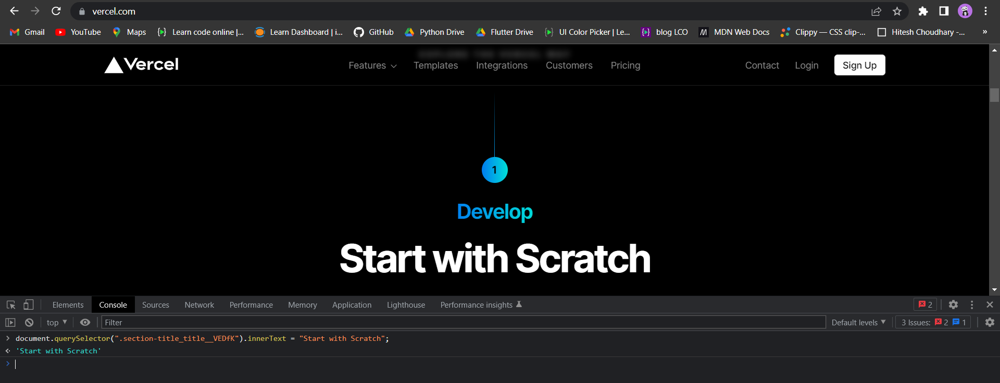


---


17. Webiste Name: [Sony](https://www.sony.co.in/)

### Topics :

    querySelector,innerHTMl

### Sample Image :


### Tasks :

     change the button text To current Date.

### Expect Output :


### Solution :
```
let date = new Date(); let cur_date = date.toString(); document.querySelector(".span4 .mlp-container .mlp-inner .mlp-collapse-content .btn-container").innerHTML = cur_date;
```

### My Output :
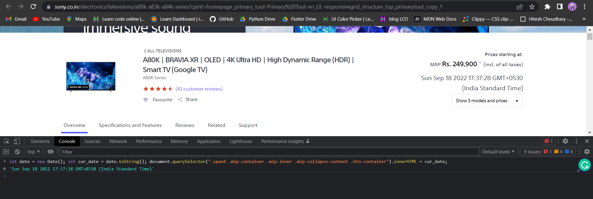


---


18. Webiste Name: [Philips](https://www.philips.co.in/)

### Topics :

     querySelector,style,backgroundcolor

### Sample Image :


### Tasks :

    change the background colour blue to orange

### Expect Output :


### Solution :
```
document.querySelector(".footerpage .p-footer-content .p-footer").style.backgroundColor = "orange";
```

### My Output :
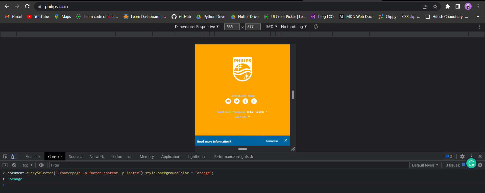


---


19. Webiste Name: [Canon](https://in.canon/)

### Topics :

          querySelector,src

### Sample Image :


### Tasks :

    extract the canon logo

### Expect Output :


### Solution :
```
document.querySelector(".navbar-brand").innerText = "https://in.canon/assets/brand/logo-300-002e45a4aec98fd92899838da9d5560f.png"
```

### My Output :
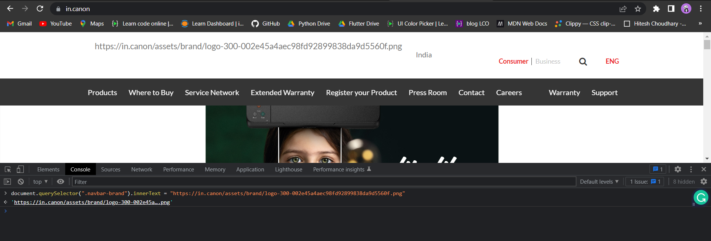


---


20. Webiste Name: [Oppo](https://www.oppo.com/in/)

### Topics :

          querySelector,style,color

### Sample Image :


### Tasks :

      Change the description colour black to orange

### Expect Output :


### Solution :
```
document.querySelector(".index__three-products-1-mb .section-box .desc").style.color = "orange";
```

### My Output :
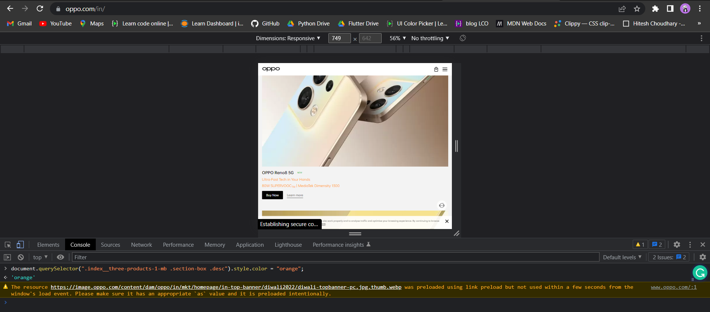


---


I hope this assignment is also usefull to you!

Thanks to:- **Hitesh Chaudhary** and **Anurag Tiwari**


